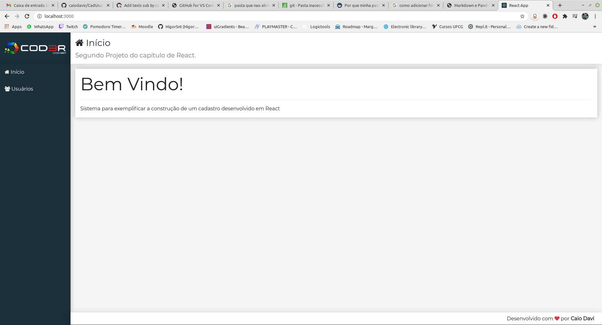
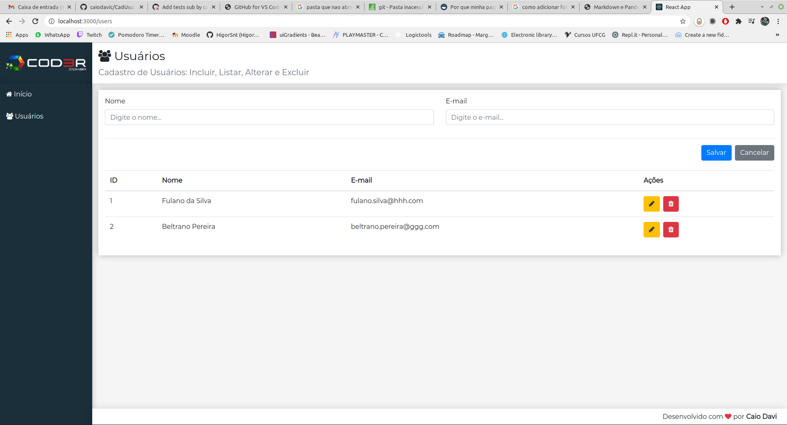

# CadUsu
## CRUD de um Cadastro de Usuários feito em um curso de React da  Cod3r.
Aplicação WEB desenvolvida em React e utilizando um JSON Server, que simula um cadastro de usuários com nome e-mail. 

 

